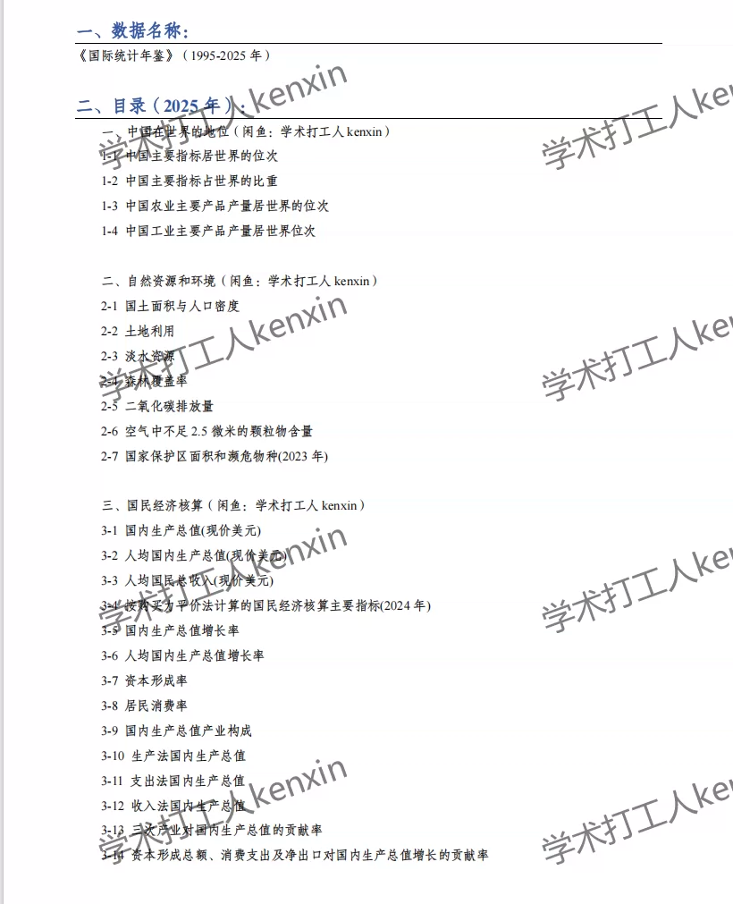
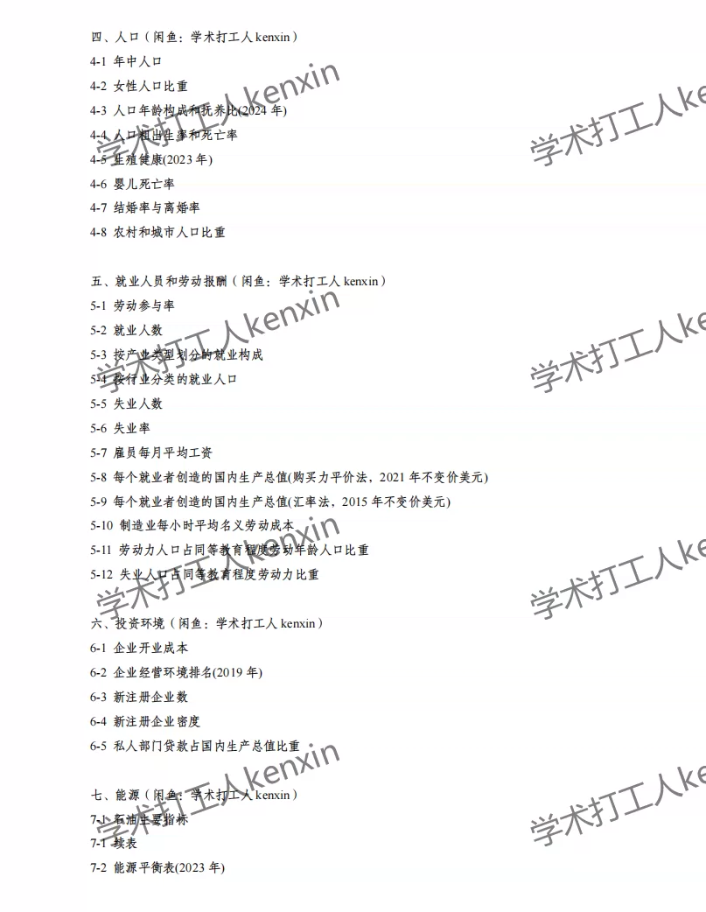
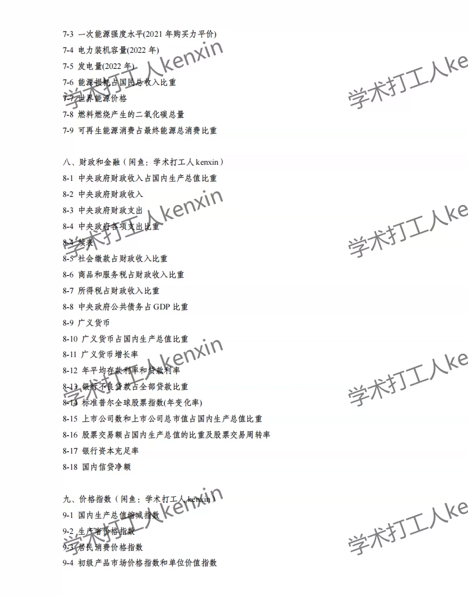
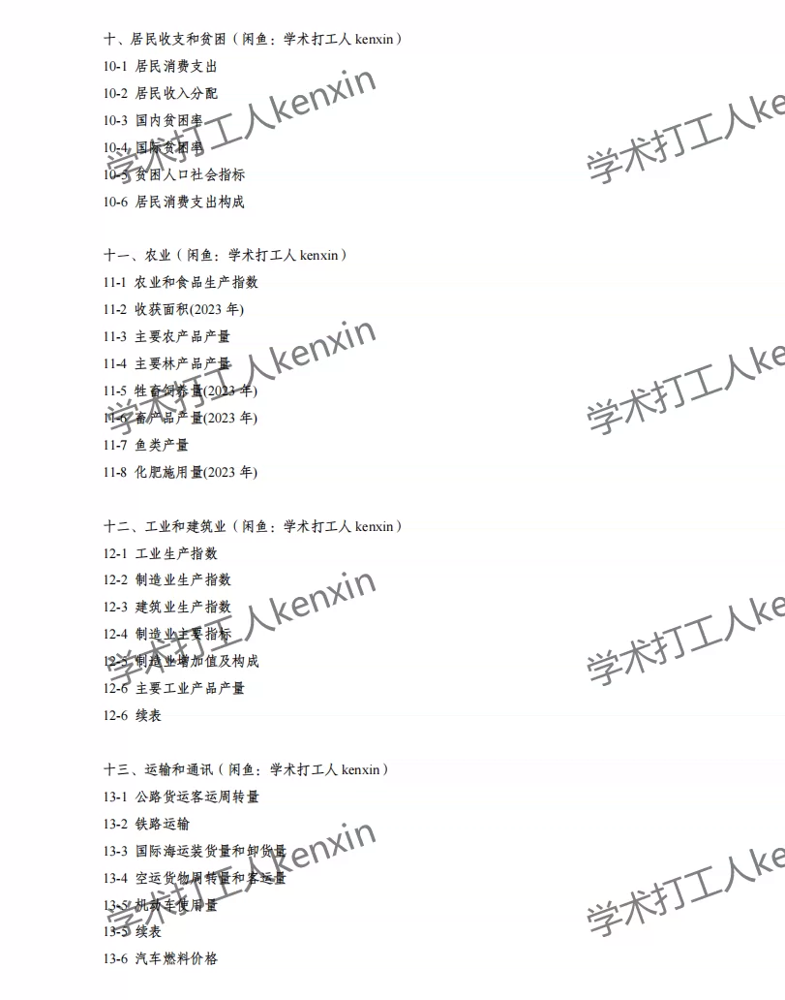
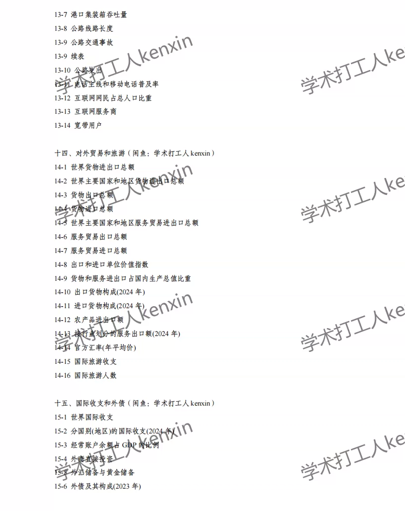
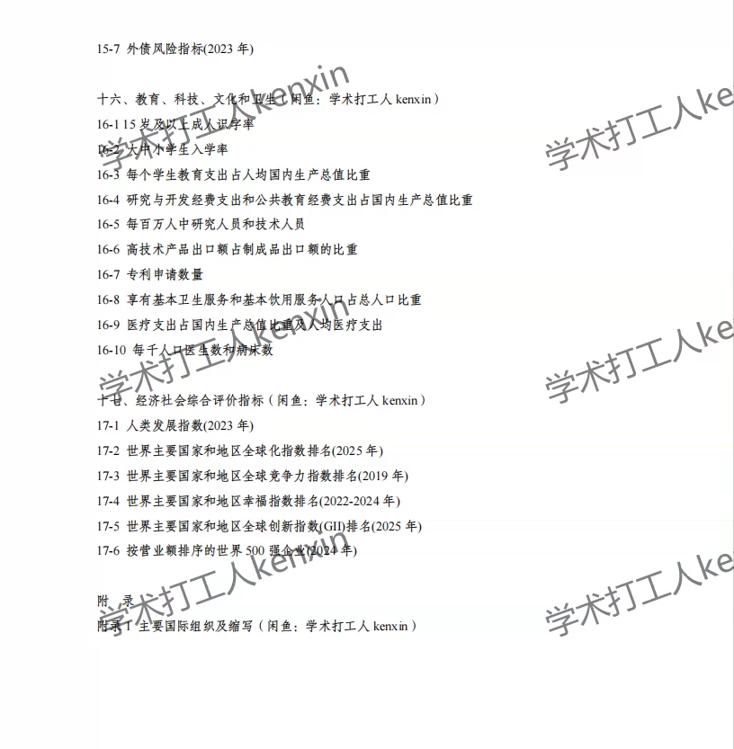
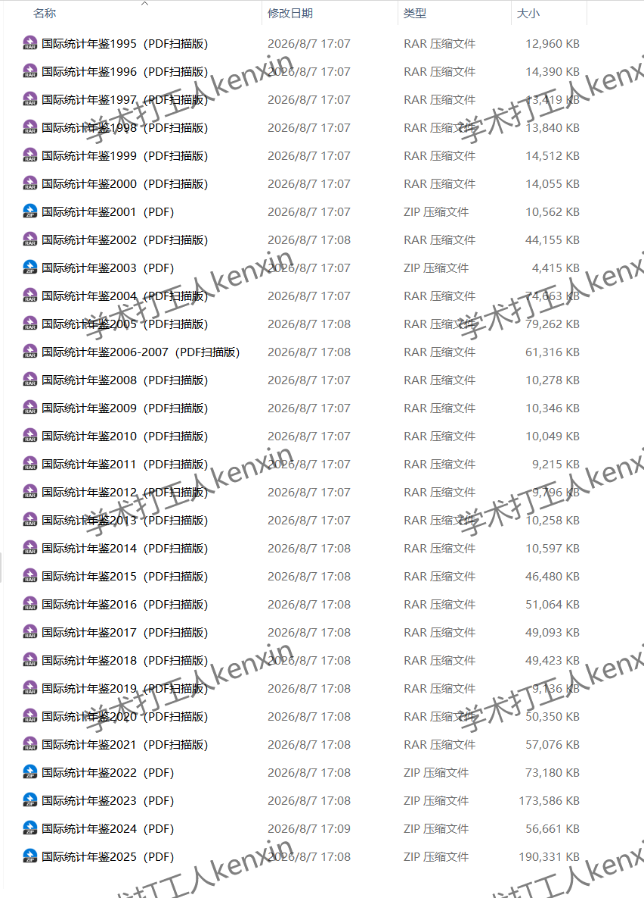

## Body

"International Statistical Yearbook" (1995-2025)

Data year: The yearbook covers the years from 1995 to 2025, with data recorded for the previous year.
All entries are raw yearbooks, not panel data compiled neatly! Please be clear before purchasing and understand that there will be no returns or exchanges after purchase.

01. Data Introduction
"International Statistical Yearbook"

02. Indicator Details
The directory is displayed in the image for reference. Due to the limited space of the image, it cannot display all information. The actual content of the yearbook should be referred to, please view it on your own and make a purchase accordingly. If you need help finding specific indicators, they are all here. After shipment, we do not support return without reason.
The displayed directory is for the year 2025, for reference only. Different statistical methods may change over time, which is common knowledge in academia. We hope everyone is aware of this.

03. Data Format
Format: Excel and PDF, placed within a zipped package.

## Images

Here is a pay link on Stripe ( https://buy.stripe.com/3cs8yP7sY87d0vu9AB ). Please contact me lonlonago@foxmail.com after funding $89, and I will send you a complete data files , thank you!

